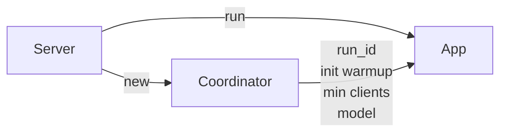
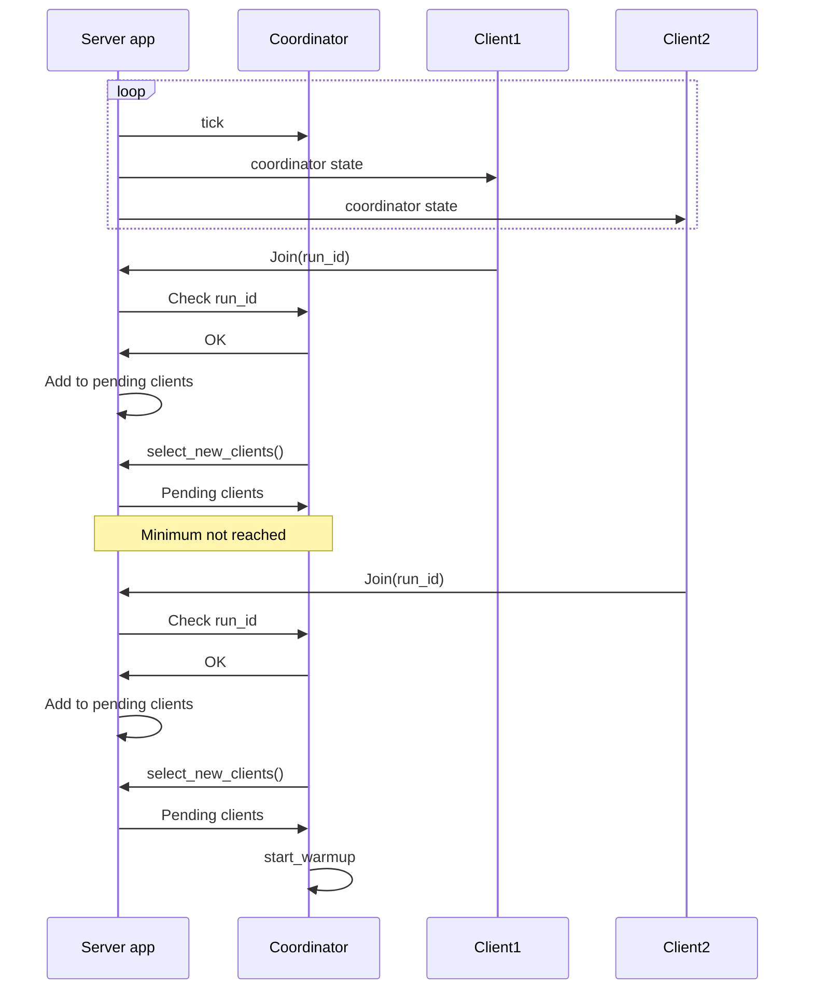
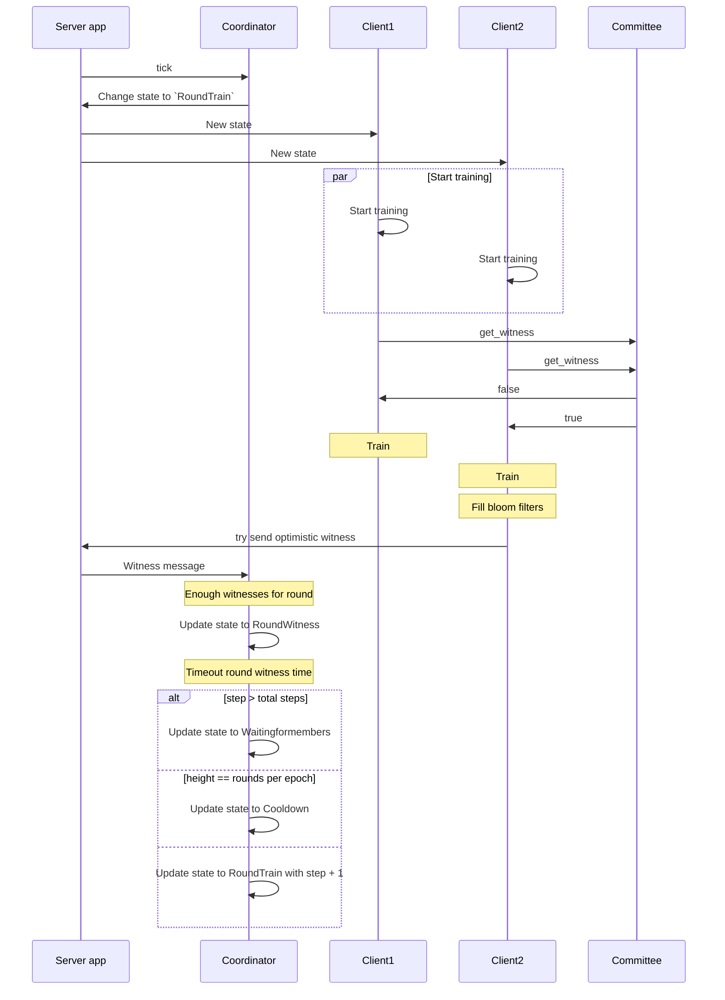

# Coordinator

## Centralized

The coordinator is a part of the server app and it's the structure that handles the round state and keeps the advancing through the rounds, also deciding each witness for the round.

The server it first created in the `main.rs` file of the server App. It's loaded using the configuration file `data.toml`.

The coordinator shares information about the model and the data server location to run the server app along with some info about the run itself, like the id, the warmup and the min clients to start training.

Every a certain period of time the server calls a tick function that just checks the state of the run and update all the correct parameters, the tick function on the server just calls the tick function on the coordinator under and then broadcast the coordinator to all the connected clients to check for the actual state of the round. The coordinator checks the actual state of the run and acts in consequence.

When a new client joins the run it has to communicate the `run_id` that wants to join. The server try to match it with the one in the coordinator to correctly join to the run. After processing the joining message the client gets added to the pending clients of the server and runs a new tick on the coordinator.

At first it will be on `WaitingForMembers` state. In this state the coordinator will ask the server for the pending clients that join previously to this tick in the round. In case the coordinator already receives enough clients to advance then it starts the warmup state and saves it in its internal data.

Once the coordinator update its state to `Warmup` it starts checking for the warmup time to pass. If a client dropped while waiting for this warmup time, the server app removes the client from the coordinator clients list and go back to the `WaitingForMembers` state.

Once the warmup time passes, the coordinator, loads all the information for the next training round and change its state to `RoundTrain`. The app server will broadcast the coordinator state that is now indicating that we have to train and the clients will check the information of the round from the coordinator.

From this point, the coordinator can transition to the `RoundWitness` state in two ways:  
1. **Time-Based Transition**: After the time defined by `max_round_train_time` elapses, the coordinator automatically updates its state to `RoundWitness`, where it waits for the witness process to complete.  
2. **Optimistic Witness Transition**: This approach allows the coordinator to transition to the `RoundWitness` state earlier if a majority of the required witnesses are received before the time limit. This enables the round to progress faster without waiting for the full duration.  

The witness for each round is chosen randomly from all the clients and is assigned in the `start` function of the `TrainingStepMetadata` struct. The `CommitteeSelection` struct is responsible for defining and selecting the participants for the round. It includes the `get_witness` function, which elects the witness using a seed provided by the coordinator in the `random_seed` field.  

The `WitnessProof` struct contains information about whether a client is the witness for the round, along with its position and index in the vector of clients. The elected witness is responsible for creating the bloom filters and sending them to the coordinator.

The witness attempts to send an **opportunistic witness** message once it finishes training its assigned data and all the batches have been taken and trained by the other clients. This process happens in the `apply_distro_result` function.  

The server receives a `Witness` message from the client and forwards it to the coordinator, along with the necessary data, by calling the `witness()` function. The coordinator validates that the message is from the actual witness for the round and then adds the result to the `witnesses` vector. If enough witness responses are received, the coordinator assumes it is safe to transition to the `RoundWitness` state.

In the `RoundWitness` state, the tick function checks for a timeout using the `round_witness_time` parameter. Once the timeout expires, the coordinator identifies any clients that need to be dropped due to inactivity (e.g., no health checks sent or disconnections during training) and removes them from the list of active clients.  

Depending on the stage of training, the coordinator will then:  
- Return to the `WaitingForMembers` state if the last step was reached.  
- Transition to the cooldown state if the height of the round has reached the epoch limit. After the cooldown period, the coordinator waits for clients to restart training.  
- Transition back to the `RoundTrain` state and prepare the round info for the next round.  

In the `start` function, the client spawns a new task to repeatedly send health checks to the server. Nodes, also known as trainers in this state, are assigned a score determined by the coordinator using the `trainer_healthy_score_by_witnesses` method. This score increases as a client sends the required data to be added to the participants' bloom filters, allowing the coordinator to confirm that the client is actively participating in the training.  

A node also sends a list of other nodes it considers unhealthy to the server using the `HealthCheck` message. The coordinator processes this information to determine whether those nodes are healthy. Nodes deemed inactive or non-participatory are marked for removal in the next round.

## Decentralized

TODO

