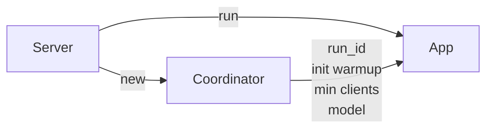
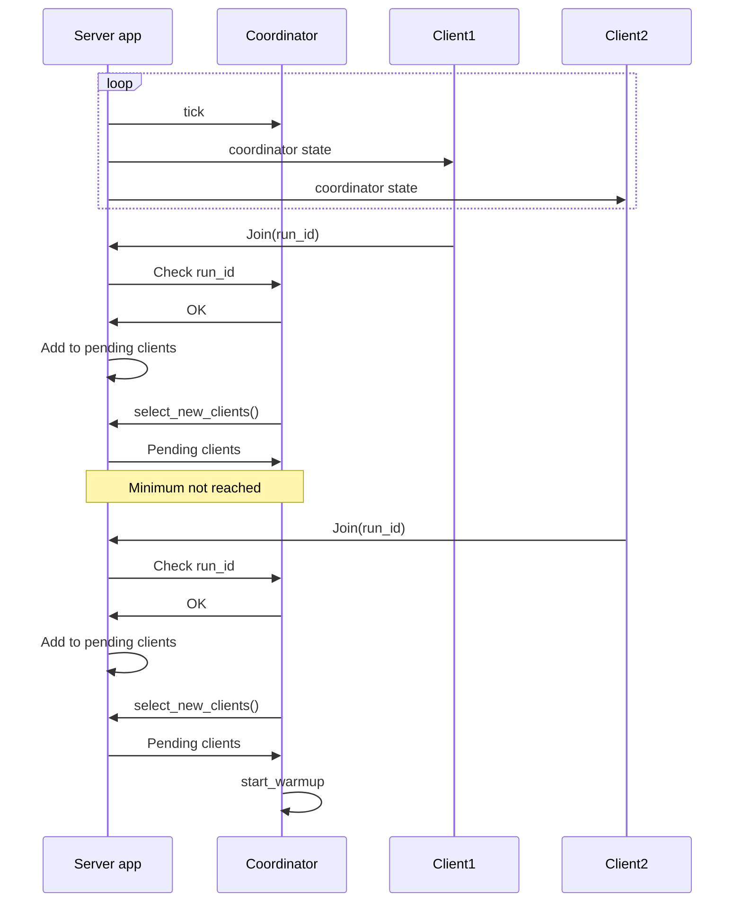
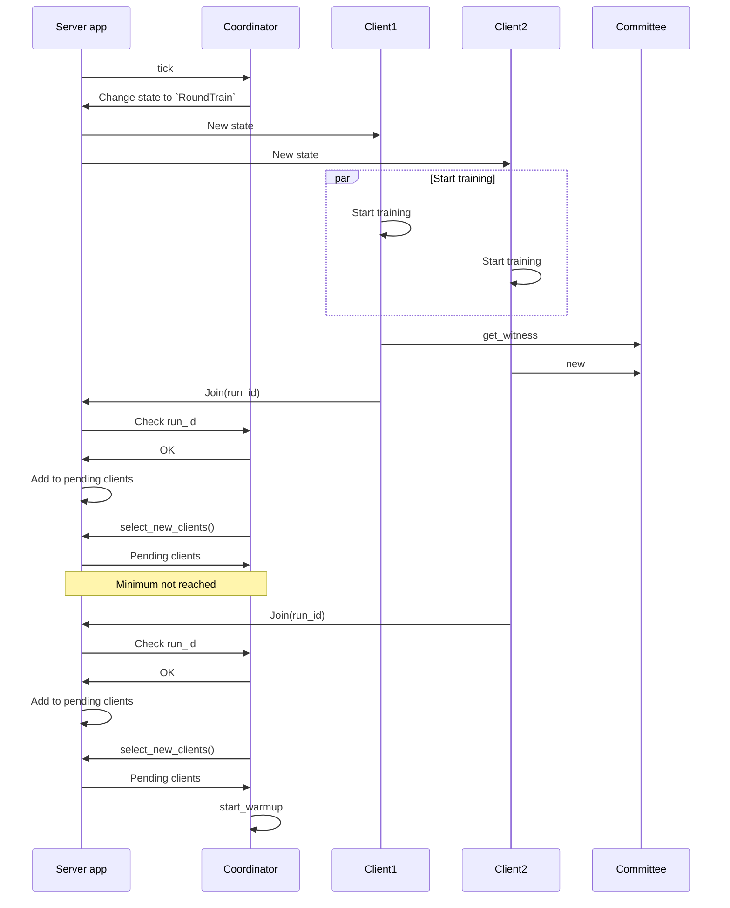

# Coordinator

The coordinator is a part of the server app and it's the structure that handles the round state and keeps the advancing through the rounds, also deciding each witness for the round.

The server it first created in the `main.rs` file of the server App. It's loaded using the configuration file `data.toml`.

The coordinator shares information about the model and the data server location to run the server app along with some info about the run itself, like the id, the warmup and the min clients to start training.

Every a certain period of time the server calls a tick function that just checks the state of the run and update all the correct parameters, the tick function on the server just calls the tick function on the coordinator under and then broadcast the coordinator to all the connected clients to check for the actual state of the round. The coordinator checks the actual state of the run and acts in consequence.

When a new client joins the run it has to communicate the `run_id` that wants to join. The server try to match it with the one in the coordinator to correctly join to the run. After processing the joining message the client gets added to the pending clients of the server and runs a new tick on the coordinator.

At first it will be on `WaitingForMembers` state. In this state the coordinator will ask the server for the pending clients that join previously to this tick in the round. In case the coordinator already receives enough clients to advance then it starts the warmup state and saves it in its internal data.

Once the coordinator update its state to `Warmup` it starts checking for the warmup time to pass. If a client dropped while waiting for this warmup time, the server app removes the client from the coordinator clients list and go back to the `WaitingForMembers` state.

Once the warmup time passes, the coordinator, loads all the information for the next training round and change its state to `RoundTrain`. The app server will broadcast the coordinator state that is now indicating that we have to train and the clients will check the information of the round from the coordinator.

From here, there are two possibilities for the coordinator to go to the next state that is `RoundWitness`. There's the usual way that is after some time defined by `max_round_train_time` the state will update and the coordinator will automatically now wait in the `RoundWitness` state and the other way is known as the optimistic witness.
The optimistic witness is basically a way to go to the next state faster if we get a majority of witnesses that we need to go on with the round without waiting for the limit time.

The witness for each round is elected randomly among all the clients, and is assinged in the `start` function for the `TrainingStepMetadata` struct. The `CommitteeSelection` is the struct that will define and select the different participants for this round and has the function `get_witness` that will elect the witness for the round using a seed comming from the coordinator in the `random_seed` field. The `WitnessProof` basicaully contains if the client is the witness of this round and its position and index in the vector of clients. The witness will create the bloom filters and then will be the one that has to send those bloom filters to the coordinator.

The witness will try to send an oportunistic witness once it finishes to train its assigned data and all the batches are taken to train by the other clients, this happens in the `apply_distro_result` function. The server will receive a `Witness` message from client that will pass it out to the coordinator with the necessary data calling the `witness()` function.
The coordinator will validate that the received message came from the actual witness of the round and will push the result to the `witnesses` vector, if we receive enough witnesses responses then we can asume that its safe to go to the new state `RoundWitness`. The tick in this state will only check for a timeout using the `round_witness_time` time and when is ready the coordinator will search for any clients that have to be dropped, because they died and did not sent a healthcheck or simply disconnects while training, and remove it from the list of active clients. Depending on which step of the training we are, the coordinator will:
- Go back to waiting for members if the last step was reached.
- Go to cooldown state if the height of the round reached the limit of the rounds per epoch. After the cooldown time passes the coordinator waits for clients to start training again.
- Go back to round train and get the round info for the upcoming round.

In the `start` of the client it will also spawn a new task to repeteadly sent healthchecks to the server. The nodes also known as trainers in this state, will be have an associated score that will be determined by the coordinator using the `trainer_healthy_score_by_witnesses`, the score will increase while the clients send the correspondent data to add to the participants bloom filters, that will the coordinator will know that the clients is effectively participating in the training. The node will send all the other nodes that are not consider healthy to the server with the `HealthCheck` message. The coordinator will handle that and determined if that node is healthy and it will mark them to drop in the next round if they are no consider alive or participating.

