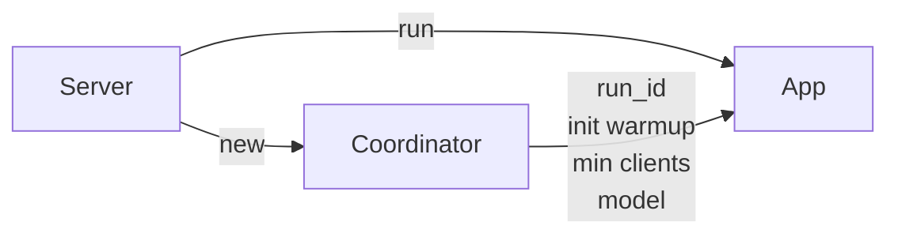
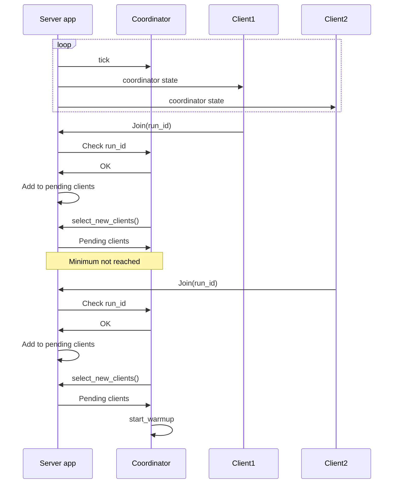

# Coordinator

The coordinator is a part of the server app and it's the structure that handles the round state and keeps the advancing through the rounds, also deciding each witness for the round.

The server it first created in the `main.rs` file of the server App. It's loaded using the configuration file `data.toml`.

The coordinator shares information about the model and the data server location to run the server app along with some info about the run itself, like the id, the warmup and the min clients to start training.

Every a certain period of time the server calls a tick function that just checks the state of the run and update all the correct parameters, the tick function on the server just calls the tick function on the coordinator under and then broadcast the coordinator to all the connected clients to check for the actual state of the round. The coordinator checks the actual state of the run and acts in consequence.

When a new client joins the run it has to communicate the `run_id` that wants to join. The server try to match it with the one in the coordinator to correctly join to the run. After processing the joining message the client gets added to the pending clients of the server and runs a new tick on the coordinator.

At first it will be on `WaitingForMembers` state. In this state the coordinator will ask the server for the pending clients that join previously to this tick in the round. In case the coordinator already receives enough clients to advance then it starts the warmup state and saves it in its internal data.

Once the coordinator update its state to `Warmup` it starts checking for the warmup time to pass. If a client dropped while waiting for this warmup time, the server app removes the client from the coordinator clients list and go back to the `WaitingForMembers` state.

Once the warmup time passes, the coordinator, loads all the information for the next training round and change its state to `RoundTrain`. The app server will broadcast the coordinator state that is now indicating that is we have to train and the clients will check the information of the round from the coordinator

Once a certain time passes defined by the `max_round_train_time` parameter, then the coordinator change its state to the `RoundWitness` indicating that the round of training is finished and the coordinator will wait to check that all the nodes calculated the results correctly. While the coordinator keeps being in the training round the server will keep receiving Witness messages from the clients that will be passed to the coordinator calling the `witness()` function where the coordinator will validate the witness for a client and add it to the witnesses of the round.

Once the time for the witness round ends the coordinator will search for any clients that have to be dropped, because they died and did not sent a healthcheck or simply disconnects while training, and remove it from the list of active clients. Depending on which step of the training we are, the coordinator will:
- Go back to waiting for members if the last step was reached.
- Go to cooldown state if the height of the round reached the limit of the rounds per epoch.
- Go back to round train and get the round info for the upcoming round.

