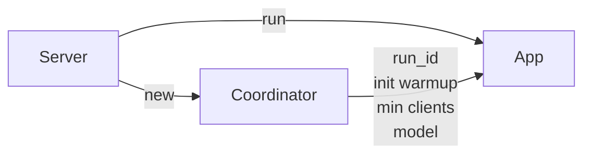
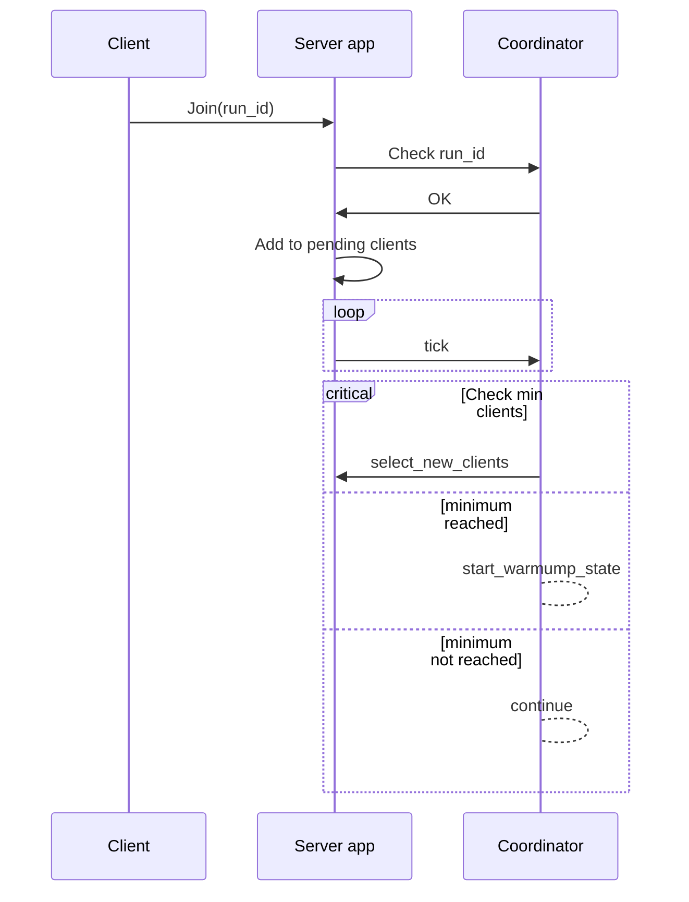

# Coordinator

The coordinator is a part of the server app and it's the structure that handles the round state and keeps the advancing through the rounds, also deciding each witness for the round.

The server it first created in the `main.rs` file of the server App. It's loaded using the configuration file `data.toml`.

The coordinator shares information about the model and the data server location to run the server app along with some info about the run itself, like the id, the warmup and the min clients to start training.

Every a certain period of time the server calls a tick function that just checks the state of the run and update all the correct parameters, the tick function on the server just calls the tick function on the coordinator under. THe coordinator checks the actual state of the run and acts in consequence.

When a new client joins the run it has to communicate the `run_id` that wants to join. The server try to match it with the one in the coordinator to correctly join to the run. After processing the joining message the client gets added to the pending clients of the server and runs a new tick on the coordinator.

At first it will be on `WaitingForMembers` state. In this state the coordinator will ask the server for the pending clients that join previously to this tick in the round. In case the coordinator already receives enough clients to advance then it starts the warmup state and saves it in its internal data.

