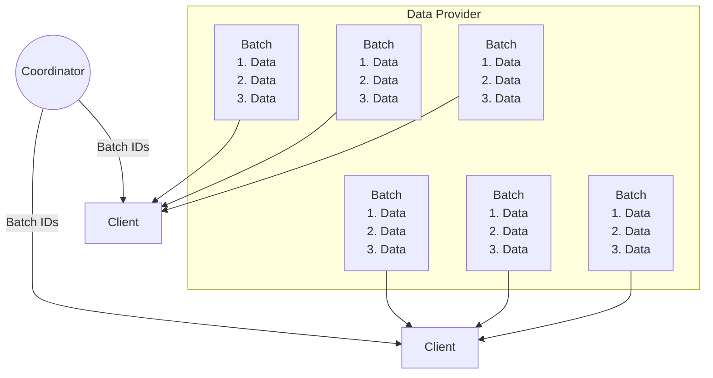

# Data Provider  

The data provider is the interface that will be implemented by the different structures responsible for parsing the training data and creating samples for the clients to use when training a model. There's three different structures ways to declare a data provider depending on how they will host the data and how the clients will request them:
- **Local data provider** where the client already contains the data to be used on training.
- **HTTP data provider** the clients will recieve a list of urls to make request on where all the necessary data of training is hosted.
- **TCP data provider** a local server separated from the client that the clients could communicate using TCP to get the training data.

## Overview  

The data provider acts as a server that can be accessed via TCP by clients to
obtain the data they need for training.  

When a client starts a round of training, it receives an ID or a range of IDs
from the coordinator, representing all the batches that will be used for that
round. Each batch contains a specific range of the overall data. The client can
then call the data provider with the assigned IDs for the run and fetch the
corresponding data to begin training.  

To better understand how the data is partitioned for each client, refer to the
following diagram:  

The number of batches used for training in a run, as well as the indexes of
data that each batch contains, can be configured.  

## Deep Dive

For the coordinator's initial state, the `state.toml` file contains configuration details for the entire run. A key section to consider is `[model.LLM.data_location]`, which specifies whether the data will be hosted on a TCP server, accessed via HTTP, or stored in a local folder.  

When loading a model, the required configuration depends on the data provider implementation being used:  

1. **TCP Server**:  
   - If the data provider is configured as a TCP server, an additional file named `data.toml` is required.  
   - This file contains configurations for local training, including:  
     - Data location  
     - Token size  
     - Sequence length  
     - A seed to shuffle the data if necessary  
   - An example `data.toml` file can be found in `psyche/config` within the various initial state examples.  

2. **HTTP Provider**:  
   - For the HTTP data provider, no additional configuration file is needed.  
   - The required fields for this setup include:  
     - The URL (or a set of URLs) from which the data will be fetched  
     - Token size (in bytes)  
     - A shuffle seed, if data shuffling is desired.

3. **Client Hosting the Data**:  
   - In this case, the client must simply provide the URL where the data is hosted.

The `init_run` function initializes the data provider using the configuration
and creates a `DataFetcher`, the structure responsible for managing the data
fetching process. The data fetcher is part of the `TrainingStepMetadata`, which
holds the internal data for the training step within the `StepStateMachine`,
along with other metadata—one for each step.  

Once the data provider is created and included in the state machine, it will be
used at the start of the epoch and during every training step. The client
monitors changes in the coordinator's state, and upon detecting a step
transition, it calls the `apply_state` function for the `RunManager`. This, in
turn, calls the `apply_state` function for the `StepStateMachine`. If the state
indicates that a training round is starting, the `start` function for the
`TrainingStepMetadata` is invoked.  

The `start` function initiates the actual training process on the client side.
Its first task is to fetch the data required for training using the
`assign_data_for_state` function. This function determines the number of
batches for the round and the indices of data within each batch. The client is
then assigned an interval of batch IDs, called `data_assignments`, which it
fetches from the data provider using the `fetch_data` function of the
`DataFetcher`.  

The `fetch_data` function parses the batch IDs using the data indices per batch
to calculate the actual intervals of data to use. It creates a channel to send
and receive batches. Once the data intervals are calculated, the client calls
the `get_samples` function on the data provider to retrieve the raw data for
those IDs. This process repeats in a loop until all batch IDs are requested and
sent through the channel.  

On the other end, the receiver is used in the `train` function. It continuously
receives data from the channel and uses it for training until all data is
consumed.  
