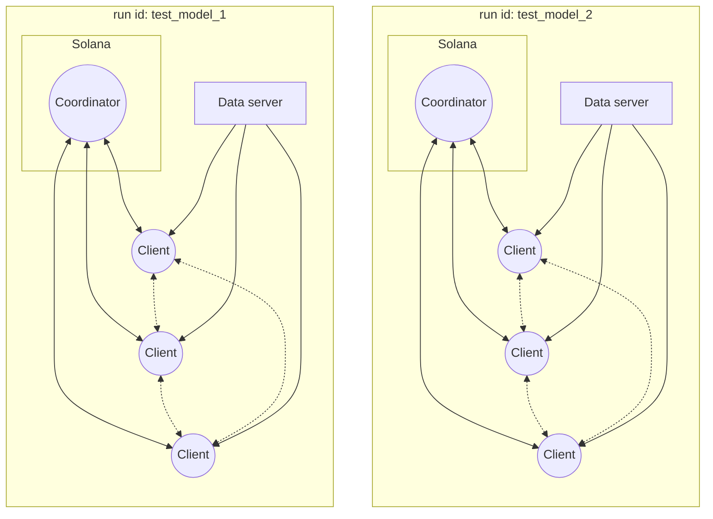
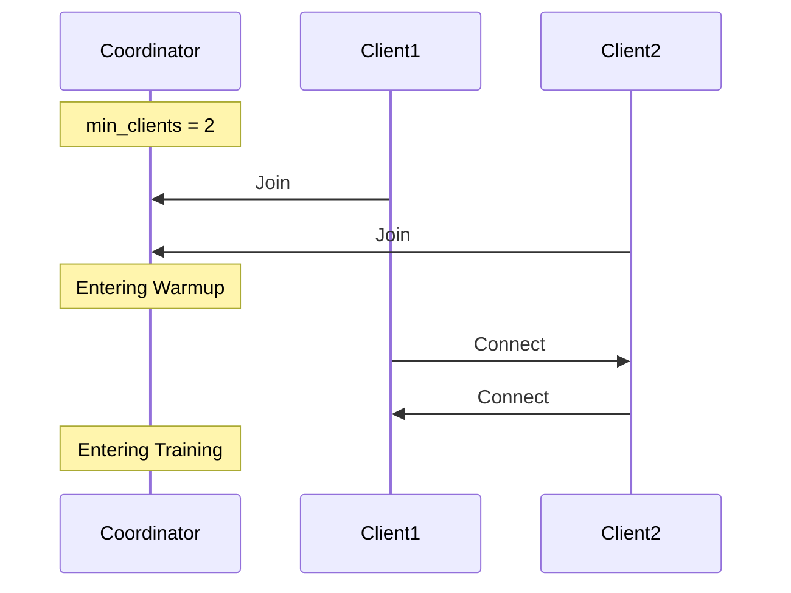
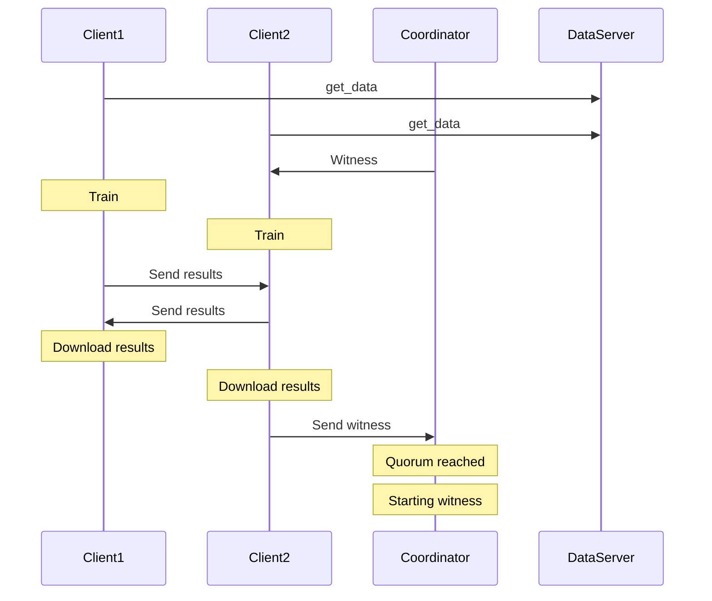
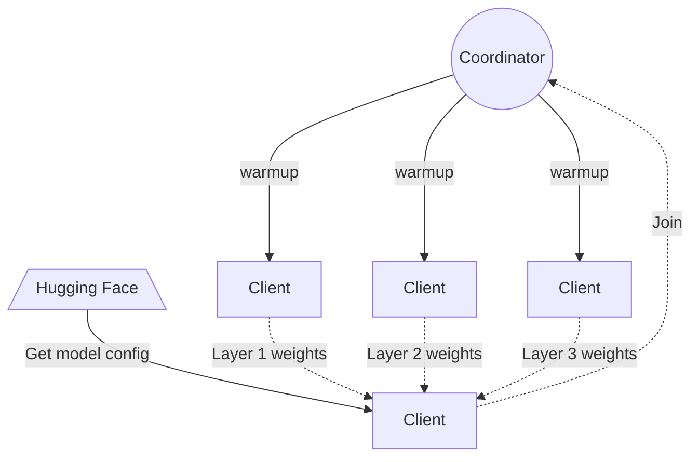

# Overview

Psyche is the system that enables coordination between untrusted nodes to collaboratively train a machine learning (ML) model using concepts derived from DisTrO optimizer.

The system is composed of three main actors:

- **Coordinator**: Responsible for managing a training run among all the clients. Each training run has one coordinator that oversees the entire process. The coordinator is implemented as a program running on the Solana Blockchain.
- **Client**: A user participating in a training run. Clients receive the model to be trained and a specific dataset for that run. They communicate with the coordinator to progress the training run and use a peer-to-peer network to share their results at each training step with other clients.
- **Data Provider**: A server that stores the data to be used for model training.

# How it works

## How a training run looks like

The training process for a specific model is divided into distinct steps that progress in a coordinated manner. The process is broken into rounds, and these **rounds** are grouped into **epochs**. The entire training process spans multiple epochs.

During a training run, clients primarily perform three tasks:

- **Training**: Train the model using a subset of the data.
- **Witnessing**: Verify the liveness and correctness of other participants.
- **Verifying**: Recompute and compare results to identify and mitigate malicious participants.

### Warmup

At the start of a run, all clients have a window of time to join the run by notifying the coordinator and connecting to the other participating clients. This warmup phase occurs only at the beginning of the run or after completing an epoch.

### Training

At the beginning of the run, after the _warmup_ phase ends, clients are assigned specific tasks that require them to train the model on a portion of the data.

If clients have already been training (i.e., it is not the first round of the run), they will apply the results from the previous round, then retrieve the data sample they need for the current round. After completing this training step, each client emits a message containing their training results and a commitment that binds them to those results.

Once the training results are broadcasted, clients begin downloading results from other participants to later incorporate them into their models.

### Witnessing

At the start of each round, one or more clients may be randomly selected as witnesses. The number of witnesses can be configured. Witness clients train the model as usual but also build bloom filters that track which nodes are actively participating and providing valid results.

The coordinator advances the run from the **training** state to the **witness** state in one of two ways:

- If enough witnesses observe all results and reach a **witness quorum** for the round, they notify the coordinator that it is safe to advance. This process, known as **opportunistic witnessing**, accelerates state transitions.
- If witnesses do not receive all required results or continue training, the coordinator transitions to the new state after a set timeout.

During the witness state, there is a brief slack period for non-witness nodes to catch up by downloading any remaining results. The coordinator also uses the bloom filters to identify and remove idle or malicious participants.

Once the witness round concludes, the coordinator returns to the training round. Clients are assigned new data, and the process repeats. After a predefined number of rounds, a **cooldown** round occurs, marking the end of an **epoch**.

Here's a high-level overview of the process. Additional details exist, but this captures the overall flow:

### Verifying

TODO

## Model sharing

When a run starts, all clients should download the model parameters, tokenizer configuration, and model configuration from HuggingFace, where the model must have been previously uploaded (TODO: add more details on uploading a model). Each client will maintain the updated model while receiving new gradients from other clients and applying them.

When a new client joins a specific run, it would not be accurate for it to download the model from HuggingFace, as the model parameters would have already been modified by others. Instead, the new client must synchronize with the training progress by obtaining the latest model parameters from a peer-to-peer (P2P) network where all the other clients are connected. This allows the new client to receive parts of the model from other clients and assemble the updated model to reflect its current state, enabling it to continue training effectively.

The new client would still need to connect to HuggingFace to retrieve the model configuration along with the tokenizer. However, it will iterate over each layer with a set of parameters, requesting one layer from each client. This process will take place during the **warmup** state while the coordinator waits to start another training run.

