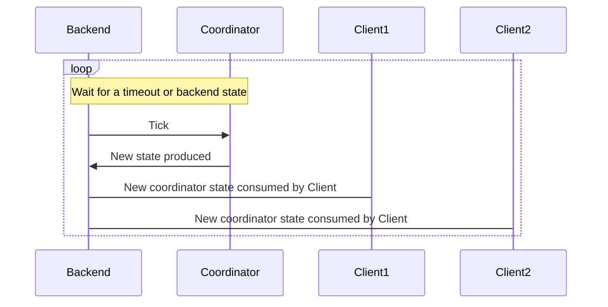
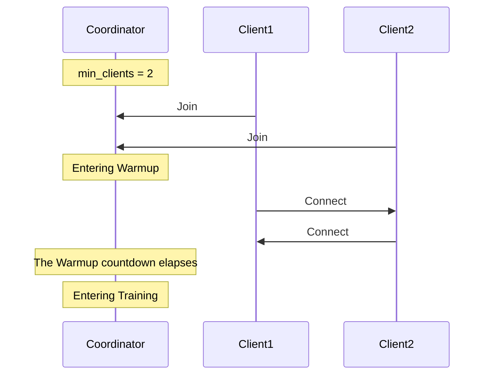
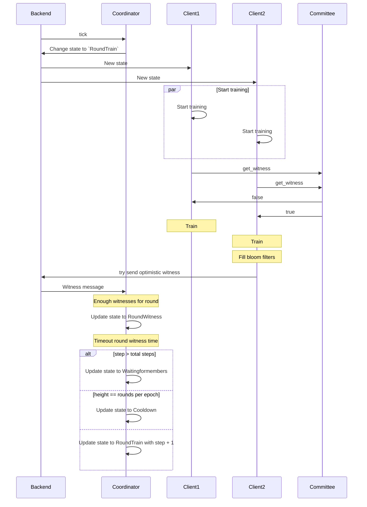
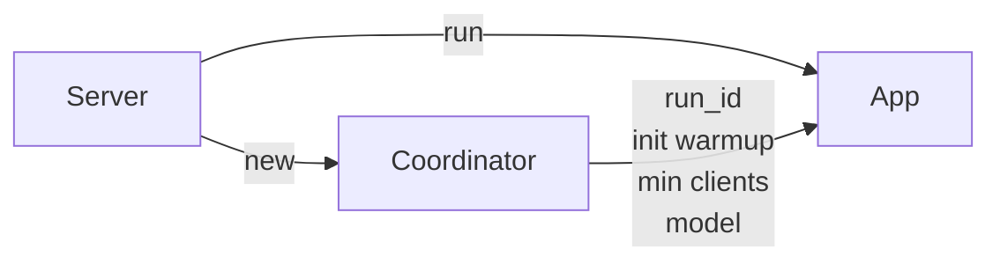

# Coordinator

The Coordinator stores metadata about the training run's state and a list of participants.

It handles the transition between each Phase of a Round, and provides a random seed that's used to determine data assignments, witnesses, and more.

It's responsible for providing a point of synchronization for all clients within a run.

## Ticks (States Transitions)

The coordinator behaves like a state machines, moving from one state to another, with each state transition having specific requirements.

When certain events occur or time-based conditions are met, the Coordinator can be "ticked" forwards to transition from one Phase to another Phase.

### Beginning an Epoch (state: WaitingForMembers)

The Coordinator begins in the `WaitingForMembers` phase, with no clients connected.

Whatever backend you're running the Coordinator in should accept pending clients to be added to upcoming Epochs.

When inside the `WaitingForMembers` phase, your backend will pass new clients to the Coordinator until a configured `min_clients` threshold is met, at which point the coordinator's `tick` will transition it to the `Warmup` phase.

### Data Warmup (state: Warmup)

This phase is designed to let all clients download the model & load it onto their GPUs.

If a client has dropped whilst waiting for the warmup time, the Backend then removes the client from the Coordinator's clients list.

If the number of clients falls below min_clients, the Coordinator goes back to the `WaitingForMembers` phase.

Once the `Warmup` time passes, the Coordinator loads all the information for the next training round and change its phase to `RoundTrain`. The Server will broadcast this `Training` Coordinator state to all clients.

### Training (state: RoundTrain)

In this phase, the Coordinator provides a random seed.

Each client can use this seed, alongside the current round index and epoch index to determine which indicies of the training data to use.

Each client then proceeds to run the training on the selected training data.

This state will end when clients later exchanges `Witness` messages.

#### Witnessing training results

As clients complete their training, they send their results to all other clients, including the Witnesses. The witnesses will each send a **witness proof** to the Coordinator, building towards a **witness quorum**.

A witness proof contains a bloom filter describing which pieces of data the witness recieved training results for, and which clients did that work. Elected witnesses are responsible for creating these witness proofs and and sending them to the Coordinator.

The witnesses for each round are chosen randomly from all the clients, using the same random seed as for data assignments. A witness will attempt to send an **opportunistic witness** message once it's seen a recieved a training result for every single batch in the current round.

#### Witness Quorum

The Coordinator advances the run from the _Training_ phase to the _Witness_ phase in one of two ways:

- If enough witnesses observe all results and reach a **witness quorum** for the round, they notify the Coordinator that it is safe to advance. This process, named **opportunistic witnessing**, accelerates the transition to the _Witness_ phase, rather than having to wait a fixed time for training results.
- If witnesses do not receive all required results from other clients before the maximum time specified for the _Training_ phase, the Coordinator will nontheless transition to the _Witness_ phase after the maximum _Training_ time elapses.

### Witness phase (state: RoundWitness)

This phase exists to give the witnesses an opportunity to send their proofs to the Coordinator in the event that they have not received enough training results from other clients to have reached the quorum and send their proofs opportunistically.

There is also brief slack period for non-witness nodes to catch up by downloading any remaining results they might have not recieved.

When the _Witness_ phase finishes via timeout, the Coordinator transitions from _Witness_ to the _Cooldown_ phase in three cases:

- If we are in the last round of the epoch.
- If the clients have dropped to less than the minimum required by the config.
- If the number of witnesses for the round is less than the quorum specified by the config.

Any clients that have failed health checks will also be removed from the current epoch.

### Cooldown phase (state: Cooldown)

The _Cooldown_ phase is the last phase of an epoch, during which the Cooordinator waits for either the _Cooldown_ period to elapse, or a checkpoint to have happened.

When the _Cooldown_ phase begins, the Coordinator resets the current model checkpoint state to `Checkpoint::P2P`, signifying that new joiners should download the latest copy of the model from the other participants.

Upon exiting the _Cooldown_ phase, the Coordinator transitions to the next epoch, saving the previous epoch state, and moving back to the _WaitingForMembers_ phase.

### It all comes together

Here is an overview of the whole process from a high level perspective:

## Centralized Backend

In this Backend, the Coordinator is owned and ticked forwards by a Server that communicates via clients over TCP.

The Server's Coordinator is initially configured in `main.rs`.
It's loaded using the configuration file `state.toml`.

The Server uses some parts of the Coordinator configuration, like the data server configuration, if enabled, to boot up all the functionality it needs.

When a new client joins the run it has to communicate the `run_id` that it wants to join, to ensure the client's joining the correct run. After processing the join message, the client is added to a pending clients list, and runs the Coordinator's tick function to potentially add the client into the run.

When a tick condition is met, the Server ticks the Coordinator forwards, then broadcasts the Coordinator's new state to all connected clients.

## Health checks

In the `start` function, the client spawns a new task to repeatedly send health checks to the server. Nodes, also known as trainers in this state, are assigned a score determined by the Coordinator using the `trainer_healthy_score_by_witnesses` method. This score increases as a client sends the required data to be added to the participants' bloom filters, allowing the Coordinator to confirm that the client is actively participating in the training.  

A node also sends a list of other nodes it considers unhealthy to the server using the `HealthCheck` message. The Coordinator processes this information to determine whether those nodes are healthy. Nodes deemed inactive or non-participatory are marked for removal in the next round.

## Decentralized Backend

TODO

