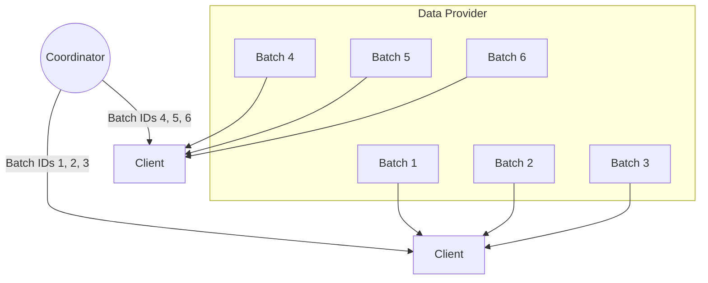

# Data Provider

When you're training an AI model, you need data to train on!
Psyche supports multiple kinds of data providers that will fetch & provide the data your model needs to train.

- **Local data provider** Each client already has the training data downloaded locally.
- **HTTP data provider** Each client will request individual pieces of data from a webserver as they are assigned that data for training
- **TCP data provider** Each client will reach out to a dedicated server over TCP & request samples of data.

## Overview

When a client starts a round of training, it is assigned an ID or a range of IDs
by the coordinator, representing all the "batches" of data that will be used for that
round. Each batch contains a specific subsection of the overall training data.

The size of a batch is always the same, and can be configured in your [run config](./enduser/run-config.md)
This order is deterministic, and is distributed across each client, so no piece of data will be trained on more than once.

To understand how the data is partitioned for each client, refer to the
following diagram:

## Provider configuration

Inside your [run config](./enduser/run-config.md), the key `[model.LLM.data_location]` specifies whether the data will be hosted on a TCP server, accessed via HTTP, or stored in a local folder.
We also support loading data from GCP as a subsection of the HTTP data provider.

The required configuration depends on the data provider implementation being used:

1. **TCP Server**:

   - If the data provider is configured as a TCP server, and an additional file named `data.toml` is required.
   - This file contains the configuration required for the TCP server, including:
     - Data location
     - Token size
     - Sequence length
     - A seed to shuffle the data if necessary
   - Example `data.toml` files can be found in `psyche/config` within the various initial state examples.

2. **HTTP Provider**:

   - For the HTTP data provider, no additional configuration file is needed.
   - The required fields for this setup include:
     - The URL (or a set of URLs) from which the data will be fetched - or, if you're loading data from GCP, a GCP bucket and an optional subdirectory.
     - Token size (in bytes)
     - A shuffle seed, if data shuffling is desired.

3. **Local Provider**:
   - Simply point to the folder where the data should be loaded from.
