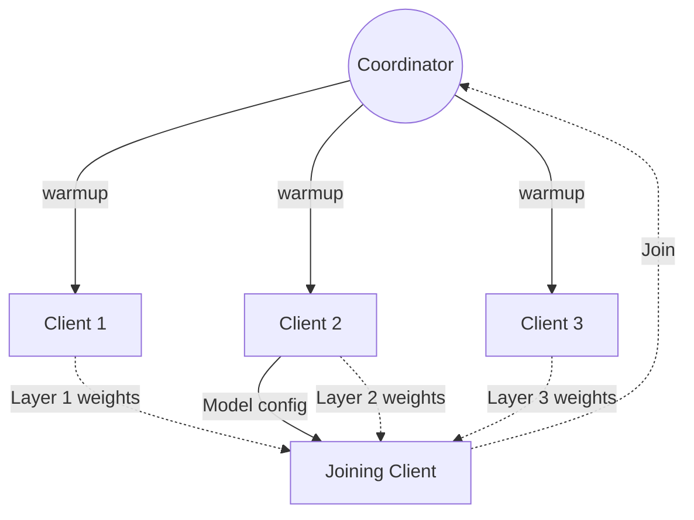

# Model sharing

When an **epoch** starts, all clients must have an identical model to train with.

At the beginning of a run, all clients must download the model parameters, tokenizer configuration, and model configuration from HuggingFace, where the model must have been previously uploaded

(TODO: add more details on uploading a model).

Each client will then modify their copy of the model by receiving new training results from other clients and applying them. This keeps everyone's copy of model identical within an **epoch** without an additional full synchronization step.

When a new client joins a run that has already progressed past its first epoch, it would not be correct for the client to download the original model from HuggingFace, as the model parameters would have already been updated during training. Instead, the new client must acquire a copy of the model from the peers who have been actively training it.

This synchronization process occurs during the _Warmup_ phase, while the coordinator waits to begin the next _Training_ phase.

To address this, we **checkpoint** the model at the end of an **epoch**, where clients save and share the entire model for new peers to join. There are two checkpointing variants: HuggingFace based and P2P based.

## HuggingFace checkpoint

In this approach, a client or a set of clients are designated as the **checkpointers** for the run. These clients upload their copy of updated model to HuggingFace after each epoch, and send the URL for this checkpoint to the coordinator. When a new client joins the run, it retrieves the checkpoint URL from the coordinator, and connects to HuggingFace to download the latest copy of the model parameters and configuration files.

## P2P checkpoint

In the peer-to-peer (P2P) approach, a new client synchronizes by obtaining the latest model directly from other peers. It receives the model information and parameters from any available peer, requesting a set of parameters for each layer from different clients. This process allows the client to assemble the latest model state and participate in the training without an explicit upload step to a central server occuring.

Here's an example of a P2P model sharing interaction:

