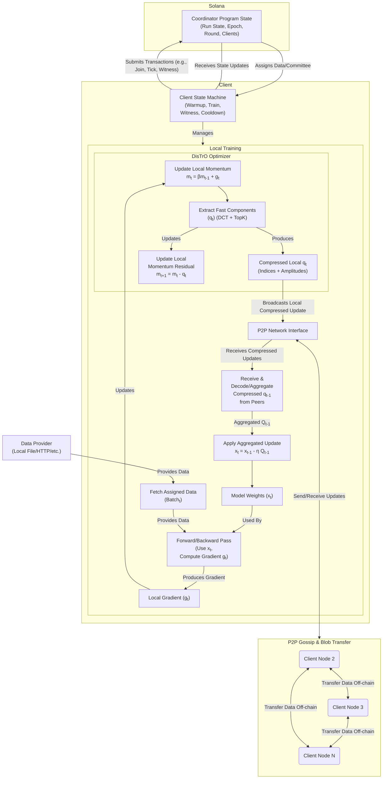

# Welcome to Psyche

    

Psyche is a system that enables distributed training of transformer-based AI models over the internet, aiming to foster collaboration between untrusted parties to create state-of-the-art machine learning models.
It leverages a peer-to-peer distributed network for communication and data sharing.

This documentation provides a comprehensive guide to understanding, using, and developing with Psyche, whether you're an end-user looking to participate in a training run, a developer interested in contributing to the project, or just curious about how it all works.

## Introduction

    

## How does it work?

At its core, Psyche is a protocol that coordinates multiple independent clients to train a single machine learning model together. Rather than running on a centralized server farm with high-speed interconnects between every accelerator (GPUs, usually), Psyche distributes the training workload across many independent computers, each contributing a small piece to the overall training process.

Psyche is built to maintain training integrity without requiring participants to trust each other. Through a combination of consensus mechanisms, game theory, and careful protocol design, Psyche will ensure that the trained model remains coherent and consistent despite being trained across disparate machines.

## Decentralized training flow

